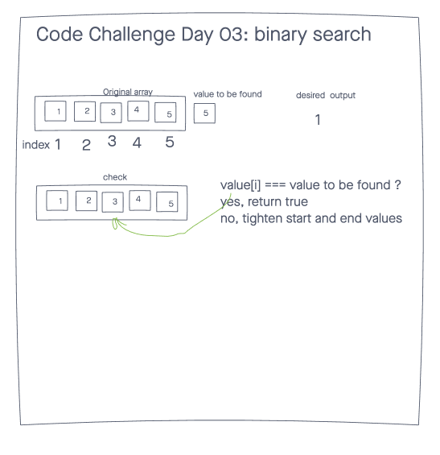

# Binary search in a sorted 1D array

Write a function called BinarySearch which takes in 2 parameters: a sorted array and the search key. Without utilizing any of the built-in methods available to your language, return the index of the array’s element that is equal to the value of the search key, or -1 if the element is not in the array.

- NOTE: The search algorithm used in your function should be a binary search.
  - Check the Resources section for details

## Whiteboard Process



## Approach & Efficiency

## Inputs / Outputs

| Input                               | Output |
| ----------------------------------- | ------ |
| [4, 8, 15, 16, 23, 42], 15          | 2      |
| [-131, -82, 0, 27, 42, 68, 179], 42 | 4      |
| [11, 22, 33, 44, 55, 66, 77], 90    | -1     |
| [1, 2, 3, 5, 6, 7], 4               | -1     |

## Algorithm

<!-- -->

## Pseudocode

```plaintext

function BinarySearch takes in `arr` and `searchKey`:

  declare start = 0;
  declare end = length of arr minus 1;

  while start <= end:
    declare middleIndex value
    if middleIndex value === searchKey, true
    else if middleIndex value < searchKey, start = searchKey + 1
    else end = mid - 1
  false

```

## Actual Code

<!-- Not sure, but was under the impression that this was not required? -->

## Visual


